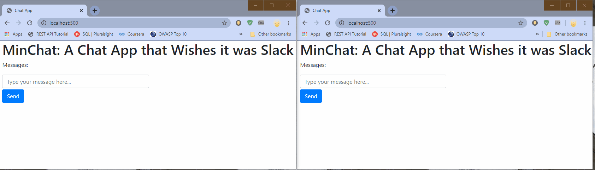

# Chat Application with Node, MongoDB, Express and Socket.IO

Note: This is incomplete and still a work in progress

I wanted to try creating a project that was a little more complex than a CRUD app. This is an endeavor to build a real-time chat application using Node.js, Express, MongoDB and Socket.io. Most of the tutorials I've found for this type of project are incomplete or don't explain things very well, so I thought this would be a good exercise in breaking down a problem as well as learning how to use Node.js.

Currently, I've managed to enable Socket.io to send messages to all available connections, and have the view update to show the new message. On submit, an event is sent to server.js, which catches the event and message and saves it to a collection on MongoDB's Atlas cloud service. After a successful save, server.js sends out an event with the newly saved message, which chat.js captures and then displays it in index.html. Once all connections are closed, all messages are deleted from the DB.

In the next steps, I'd like to set a random user name for each connection, so that instead of 'Anon user', a more identifiable name is given for the sender. After that, there should be some error handling and finer touches, like a notification informing the user that someone else is typing.

# To Run
Open a terminal in the root of the project, and run:
`npm install`
`node app.js`

Open up two browser windows and navigate to `localhost:500` in both of them.